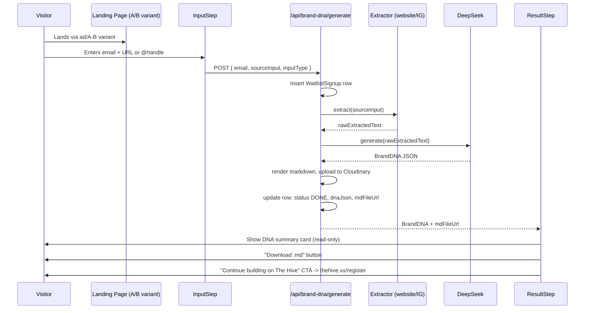

# Brand DNA Waitlist — Standalone MVP
## Architecture & Implementation Plan

**Status:** Draft for execution
**Owner:** El-Roy (Design Engineer, Takeout Media)
**Scope:** Standalone A/B test validation build, cloned from `hive-frontend-main`
**Goal:** Validate demand for "give us a link, get your Brand DNA" before investing in full Hive integration

---

## 1. Purpose & Framing

This is **not** a new feature inside The Hive. It is a disposable validation surface that happens to be built from Hive's frontend repo because the repo already has the visual language, component primitives, and a near-identical flow already speccd (Path A: Web Import → Brand DNA Summary, see `frontend-architecture_design.md` §4A).

Cloning gets us:
- The design system already wired (`globals.css` tokens, fonts, dark theme)
- UI primitives (`components/ui/`) — buttons, cards, inputs, modals
- Animation conventions (Framer Motion `AnimatePresence`, GSAP patterns)
- A pre-built (if disconnected) onboarding step UI to repurpose

What we are explicitly **not** carrying over:
- NextAuth / session auth
- `requestApi` calls to the real `hive-backend`
- Multi-tenant data model assumptions (Brand/Organization/User)
- Any existing onboarding logic/hooks tied to the live backend

This document defines what to strip, what to convert to full-stack (API routes living in this same repo), and what new pieces to build.

### Success criteria (decide before building, not after)

Define the validation threshold now. Suggested starting metrics:

| Metric | What it tells us |
|---|---|
| Waitlist signup → URL submitted rate | Is the offer (free Brand DNA) compelling enough to act on |
| Submission → completed generation rate | Technical reliability of extraction + LLM step |
| Completed → `.md` downloaded rate | Whether the output itself feels valuable |
| Completed → "Continue to Hive" click rate | Strongest signal — willingness to go further |

These numbers should be agreed with Arthur/stakeholder before launch, not retrofitted after seeing results.

---

## 2. Tech Stack (delta from current Hive frontend)

| Layer | Hive Frontend (current) | This Standalone Build |
|---|---|---|
| Framework | Next.js 16 App Router | **Same** — keep as-is |
| Styling | Tailwind v4 + `globals.css` tokens | **Same** — copy tokens verbatim |
| Animation | GSAP + Framer Motion | **Same**, reused for step transitions |
| UI Primitives | Radix UI, `@base-ui/react`, vaul, input-otp | **Keep only what's used** — trim unused primitives during clone cleanup |
| Data fetching | TanStack Query + `requestApi` hitting `hive-backend` | **Replaced** — Next.js Route Handlers (`app/api/*`) calling DeepSeek/extractors directly. No external backend. |
| Auth | NextAuth + bearer sessions | **Removed entirely** — no login, no sessions |
| Database | Postgres via Prisma (hive-backend) | **New, separate, lightweight** — Vercel Postgres or Supabase, minimal schema (see §5) |
| LLM | Vertex AI / Gemini (Scene Agent) | **DeepSeek** (OpenAI-compatible API) |
| File storage | Cloudinary (hive-backend) | **Cloudinary** — reuse same account/credentials, new upload folder (`waitlist-brand-dna/`) |

This becomes a true full-stack Next.js app: UI + API routes + DB all in one deployable unit, matching what you and I agreed on for the standalone approach.

---

## 3. Directory Structure (post-clone modifications)

Starting point is a clone of `hive-frontend-main`. Below shows what's **added**, what's **gutted**, and what's **kept as reference only**.

```
app/
  (waitlist)/                          # NEW — only route group in this app
    page.tsx                           # landing — repurposed A/B test flyer/hero
    brand-dna/
      page.tsx                         # the input → generate → result flow (route entry only)
  api/                                  # NEW — Next.js Route Handlers (this app's "backend")
    waitlist/
      route.ts                         # POST — create signup record
    brand-dna/
      generate/
        route.ts                       # POST — run extractor + DeepSeek, return BrandDNA
      download/
        route.ts                       # GET  — stream/redirect to generated .md
  layout.tsx                            # KEEP — strip NextAuth provider, keep font loading
  globals.css                           # KEEP — copy verbatim (design tokens)

components/
  ui/                                   # KEEP — trim to only what's used (buttons, cards, inputs)
  pages/
    waitlist-brand-dna/                 # NEW — mirrors existing pages/<feature> convention
      page-ui.tsx
      hooks/
        index.ts
      components/
        input-step.tsx
        generating-step.tsx
        result-step.tsx
        dna-summary-card.tsx            # read-only variant of the real onboarding's editable card

lib/
  extractors/                           # NEW
    types.ts
    website-extractor.ts
    instagram-extractor.ts              # Apify-backed
    resolve-extractor.ts
  llm/
    deepseek-client.ts                  # NEW
    brand-dna-prompt.ts                 # NEW
  render/
    brand-dna-markdown.ts               # NEW — dnaJson -> .md string
  db/
    client.ts                           # NEW — lightweight Postgres client (Prisma or Drizzle, see §5)
  cloudinary.ts                         # NEW — copy logic/pattern from hive-backend's utils/cloudinary.ts

types/
  brand-dna.ts                          # NEW — canonical BrandDNA interface (kept identical to hive-backend's future shape)

hooks/
  use-fetch.ts                          # MODIFIED — strip NextAuth/session logic, keep base requestApi shape

# REMOVE / DO NOT PORT:
#   app/(auth)/*
#   app/(dashboard)/*           — entire authenticated app surface
#   components/contexts/*       — auth/session-dependent providers
#   components/guards/*         — route guards, nothing to guard here
#   NextAuth config + middleware
```

**Why keep the `components/pages/<feature>/{page-ui, hooks, components}` convention** even though there's no Logic Engineer split happening here (it's just you): consistency with the real Hive repo means if this validates and gets folded back in later, the component shape ports over directly. Same reasoning we used for keeping the `BrandDNA` type identical.

---

## 4. The Flow (UX + Data)

This reuses the **exact sequence** already specced for Path A / Brand Brain BOX in the frontend architecture doc, with auth/save replaced by download/waitlist-confirm:



### Step-by-step UI states (`components/pages/waitlist-brand-dna/`)

1. **`input-step.tsx`**
   - Email field
   - Single input for URL or @handle, with lightweight client-side detection (regex for instagram.com, tiktok.com, linkedin.com vs. generic URL) to set `inputType`
   - Submit triggers `useGenerateBrandDNA`

2. **`generating-step.tsx`**
   - Loading state, ~10–20s realistic duration
   - Reuse existing motion-trail / GSAP loading patterns already in the repo if available, otherwise a simple staged-message loader ("Reading your brand..." → "Extracting your voice..." → "Writing your DNA...") — staged copy reduces perceived wait better than a static spinner

3. **`result-step.tsx`** + **`dna-summary-card.tsx`**
   - Read-only rendering of the same card layout described for the real (editable) onboarding DNA summary — just without inline-edit handlers
   - Primary CTA: Download `.md`
   - Secondary CTA: "Continue building on The Hive" → external link to main app's signup, optionally with `?ref=waitlist` for attribution tracking

---

## 5. Data Model (this app's own lightweight DB)

Single table, no multi-tenancy, no relations to hive-backend's schema at all:

```prisma
// schema.prisma (or Drizzle equivalent — Prisma kept for consistency with hive-backend conventions)

model WaitlistSignup {
  id                Int       @id @default(autoincrement())
  email             String
  sourceInput       String
  inputType         InputType
  status            JobStatus @default(PENDING)
  rawExtractedText  String?   @db.Text
  dnaJson           Json?
  mdFileUrl         String?
  errorMessage      String?
  createdAt         DateTime  @default(now())
  completedAt       DateTime?
}

enum InputType {
  WEBSITE
  INSTAGRAM
  TIKTOK
  LINKEDIN
}

enum JobStatus {
  PENDING
  EXTRACTING
  GENERATING
  DONE
  FAILED
}
```

No `User`, no `Organization`, no auth-claimable fields — that complexity was only needed for the integrated version. Here it's pure funnel data. Export this table (or expose a simple internal `/api/admin/export` CSV route, password-protected via a single env-var secret) when you need it for analysis.

---

## 6. The `BrandDNA` Type (canonical, must not drift)

This is the one piece of shared contract worth protecting even across two separate codebases — if this validates and gets folded into the real Hive onboarding, this type should not need to change shape.

```typescript
// types/brand-dna.ts

export interface BrandDNA {
  brandVoice: string;          // 2-3 sentence description of tone/personality
  tagline: string;
  targetAudience: string;
  coreValues: string[];
  toneAttributes: string[];    // e.g. ["confident", "playful", "direct"]
  visualDirection: string;     // free-text description for now (color/typography inference is a v2 step)
  doNotSay: string[];          // phrases/tones to avoid — useful guardrail content
}
```

Keep this list intentionally small for MVP. Resist the urge to infer colors/fonts/logo direction from scraped content yet — that's meaningfully harder (needs actual visual analysis, not just text), and it's not what's being validated. Text-based brand voice is the testable core.

---

## 7. API Routes (Next.js Route Handlers)

### `POST /api/waitlist`
Creates the `WaitlistSignup` row, status `PENDING`. Returns `{ id }`.

### `POST /api/brand-dna/generate`
Body: `{ id: number }` (the signup row to process)

```
1. Load WaitlistSignup by id
2. Set status = EXTRACTING
3. resolveExtractor(inputType).extract(sourceInput) -> rawExtractedText
   - On failure: status = FAILED, errorMessage set, return 422 with user-facing message
4. Set status = GENERATING
5. deepseek-client.generateBrandDNA(rawExtractedText) -> BrandDNA JSON
   - Prompt MUST request JSON-only output (response_format: json_object equivalent)
6. render brandDnaMarkdown(dnaJson) -> markdown string
7. Upload markdown to Cloudinary (resource_type: raw) -> mdFileUrl
8. Update row: status = DONE, dnaJson, mdFileUrl, completedAt
9. Return { dnaJson, mdFileUrl }
```

This is a single synchronous request — same reasoning as discussed earlier: no job queue needed at this volume, just an honest loading state on the frontend for the ~10-20s round trip. **Set a route timeout appropriate for Vercel's function limits** (check current plan's max duration; if on Hobby/Pro this may require `maxDuration` config in the route or moving to an Edge-incompatible Node runtime).

### `GET /api/brand-dna/download?id=`
Redirects to `mdFileUrl`, or streams it directly if you want to control the download filename (e.g. `{brand-name}-brand-dna.md` instead of Cloudinary's generated name).

---

## 8. Extractors

Same adapter pattern as the integrated design — kept identical so porting later is mechanical.

```typescript
// lib/extractors/types.ts
export interface ExtractorResult {
  rawText: string;
  sourceType: InputType;
  sourceUrl: string;
}

export interface Extractor {
  canHandle(input: string): boolean;
  extract(input: string): Promise<ExtractorResult>;
}
```

- **`website-extractor.ts`** — server-side `fetch` + `@mozilla/readability` + `jsdom` to pull clean text from arbitrary marketing sites. No third-party cost.
- **`instagram-extractor.ts`** — Apify actor call (bio, recent caption text, possibly post count/engagement signals if cheaply available). This is the only extractor with real per-call cost — worth capping daily volume via a simple counter in the DB if the A/B test gets real traffic, so a traffic spike doesn't produce a surprise bill.

`resolve-extractor.ts` picks the right one based on `inputType` set during client-side detection in `input-step.tsx`.

---

## 9. DeepSeek Integration

```typescript
// lib/llm/deepseek-client.ts
import OpenAI from 'openai';

const deepseek = new OpenAI({
  apiKey: process.env.DEEPSEEK_API_KEY,
  baseURL: 'https://api.deepseek.com',
});

export async function generateBrandDNA(rawText: string): Promise<BrandDNA> {
  const completion = await deepseek.chat.completions.create({
    model: 'deepseek-chat',
    messages: [
      { role: 'system', content: BRAND_DNA_SYSTEM_PROMPT },
      { role: 'user', content: rawText },
    ],
    response_format: { type: 'json_object' },
  });

  const parsed = JSON.parse(completion.choices[0].message.content!);
  return validateBrandDnaShape(parsed); // throw if required fields missing — fail loud, not silent
}
```

DeepSeek's API is OpenAI-compatible, so the `openai` npm package works directly — no bespoke HTTP client needed.

`BRAND_DNA_SYSTEM_PROMPT` should explicitly instruct: return only valid JSON matching the `BrandDNA` interface, no markdown fences, no preamble. Add a `validateBrandDnaShape()` guard that throws clearly if a field is missing — better to surface a `FAILED` job than silently ship a half-populated DNA card to the result screen.

---

## 10. Environment Variables (new `.env` additions)

```
DEEPSEEK_API_KEY=
APIFY_API_TOKEN=
CLOUDINARY_CLOUD_NAME=
CLOUDINARY_API_KEY=
CLOUDINARY_API_SECRET=
DATABASE_URL=                    # new, separate DB — do not point at hive-backend's
ADMIN_EXPORT_SECRET=             # simple shared-secret for the CSV export route, not full auth
```

---

## 11. Build Order

1. **Strip the clone** — remove `(auth)`, `(dashboard)`, NextAuth config, guards, contexts. Confirm the app still builds with just `globals.css`, fonts, and `components/ui/` intact.
2. **Landing page** — repurpose existing hero/flyer component for the A/B test variant(s). This is mostly content work given the flyer copy already exists.
3. **DB + Prisma schema** — single table, get migrations running against a fresh Postgres instance.
4. **`POST /api/waitlist`** — simplest possible slice, prove email capture end-to-end first.
5. **Website extractor + DeepSeek + JSON output** — prove the core loop on the easier input type before touching Apify/Instagram.
6. **`input-step.tsx` → `generating-step.tsx` → `result-step.tsx`** — wire UI to the working API.
7. **Markdown render + Cloudinary upload + download flow.**
8. **Instagram extractor via Apify** — added once the website path is proven.
9. **Admin export route** — for pulling signups/results for analysis.
10. **Rate limiting** on `/api/brand-dna/generate` (IP-based, e.g. `@upstash/ratelimit` if using Vercel, or a simple DB-backed counter) — this is the one route with real per-call cost, protect it before driving paid traffic to it.

---

## 12. Explicit Non-Goals for This Build

To keep this honestly an MVP and not scope-creep back into a parallel Hive:

- No inline editing of generated DNA
- No color/typography/logo visual inference — text-only DNA for now
- No authentication, no saved sessions, no "come back later" flow beyond the emailed result (if you choose to email it — optional, not in scope above unless added)
- No job queue/polling — synchronous request only
- No multi-platform extraction beyond website + Instagram at launch; TikTok/LinkedIn extractors are stubbed in the `InputType` enum for forward-compatibility but not built until validated

---

## 13. Path Back to the Real Hive (if validated)

Documented here so the decision isn't lost between now and whenever the A/B test concludes:

1. `WaitlistSignup` rows with `status = DONE` become the seed list for the **silent User+Org creation** approach scoped earlier for the integrated design.
2. `dnaJson` maps directly into `hive-backend`'s `Brand` model fields (`tagline`, etc.) — this is the entire reason the `BrandDNA` type was kept canonical across both codebases.
3. The extractor + DeepSeek logic in `lib/` ports into `hive-backend/src/api/brand-dna/` near-verbatim — same adapter pattern, same prompt, same validation guard.
4. The component shape in `components/pages/waitlist-brand-dna/` becomes the template for the real (editable, authenticated) Brand Brain BOX Path A flow already specced in the frontend architecture doc.
